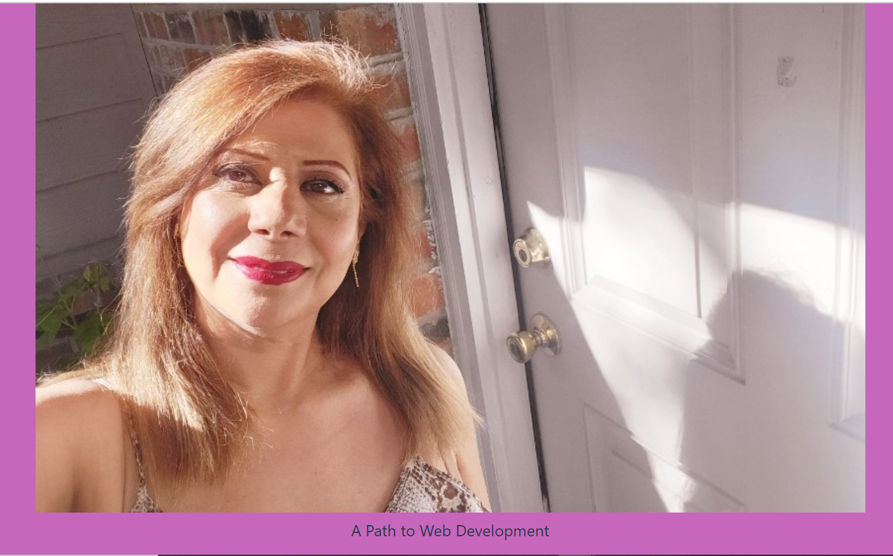
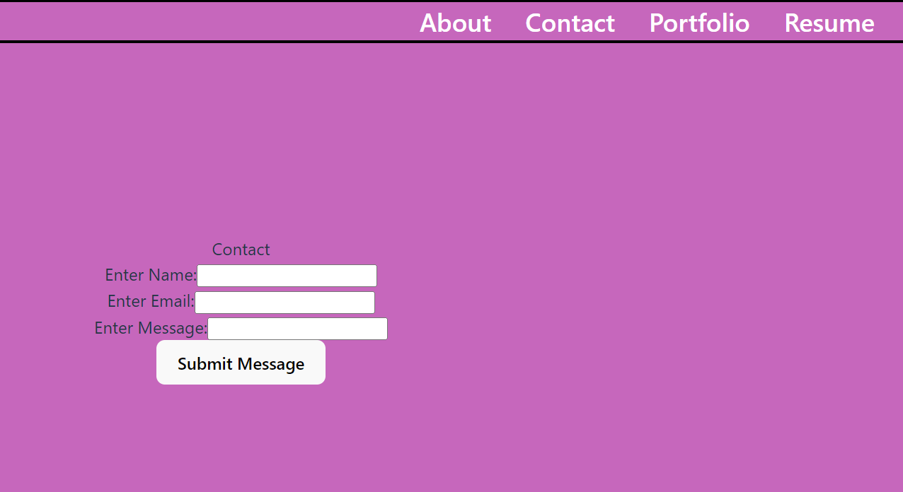
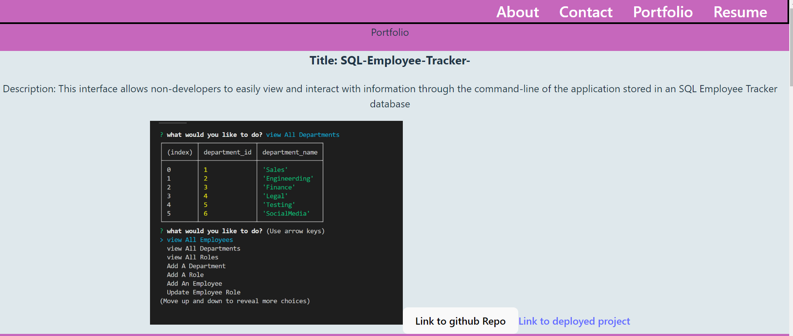

# Lily-Ebadi-React-Portfolio

## Description 
Being a web developer means being part of a community. You’ll need a place not only to share your projects while you're applying for jobs or working as a freelancer but also to share your work with other developers and collaborate on projects.

## Tables Of Contents :
Overview
The Challenge
Usage
Installation Process
Built With 
What I learned
License

## Overview

The Challenge:

The challenge was to desgin a responisve , professional website using React and other technologies that would display a recent picture or avatar of the developer , shows a header , a footer and contains a navbar with about me, contact,portfolio,and resume.

## User Story 

AS AN employer looking for candidates with experience building single-page applications
I WANT to view a potential employee's deployed React portfolio of work samples
SO THAT I can assess whether they're a good candidate for an open position

## Acceptance Criteria

GIVEN a single-page application portfolio for a web developer
WHEN I load the portfolio
THEN I am presented with a page containing a header, a section for content, and a footer
WHEN I view the header
THEN I am presented with the developer's name and navigation with titles corresponding to different sections of the portfolio
WHEN I view the navigation titles
THEN I am presented with the titles About Me, Portfolio, Contact, and Resume, and the title corresponding to the current section is highlighted
WHEN I click on a navigation title
THEN the browser URL changes and I am presented with the corresponding section below the navigation and that title is highlighted
WHEN I load the portfolio the first time
THEN the About Me title and section are selected by default
WHEN I am presented with the About Me section
THEN I see a recent photo or avatar of the developer and a short bio about them
WHEN I am presented with the Portfolio section
THEN I see titled images of six of the developer’s applications with links to both the deployed applications and the corresponding GitHub repositories
WHEN I am presented with the Contact section
THEN I see a contact form with fields for a name, an email address, and a message
WHEN I move my cursor out of one of the form fields without entering text
THEN I receive a notification that this field is required
WHEN I enter text into the email address field
THEN I receive a notification if I have entered an invalid email address
WHEN I am presented with the Resume section
THEN I see a link to a downloadable resume and a list of the developer’s proficiencies
WHEN I view the footer
THEN I am presented with text or icon links to the developer’s GitHub and LinkedIn profiles, and their profile on a third platform (Stack Overflow, Twitter)
 
## Usage :

1. Open an integrated terminal in Lily-Ebadi-React-Portfolio and switch to test file
2. Run npm i and npm build
3. Run npm run dev and the site will be available on port 3000

## Installation Process: 

1. Clone the repository from github using git clone
2. Open the cloned repository in VSC or any source code editor
3. Open the integrated terminal of the document(Lily-Ebadi-React-Portfolio) 
4. Run command nmp create vite 
5. Create a folder using mkdir
6. Using the drop down menu select React and then select JavaScript
7. Create client folder and server folder

## Depolyed Link 

## Screenshots

## built With 
React : 18.3.1
JavaScript
HTML
CSS
VSC
Vite : 5.4.1
Node.js

## What I Learned

How to create a professional portfolio with React

## License 
MIT

